# Trash Talk Blog

 

   

The hosted site can be found [here](https://trashtalk-recycler-4f184b751d0b.herokuapp.com/).

## Description
#### Motivation:
So much of online interaction is done with a tremendous amount of vitriol and people lack a sense of compassion when dealing with others online. 

#### Why Build
This app was created to provide users an opportunity to say what they really feel about a topic and get things off their chest. Once they send a message it gets run through generative AI to reconstruct (recycle) their trash talk into a more thoughtful, polite, and constructive manner (future feature not yet installed).

#### Problem Solved:
The app will help alleviate the mental health concerns associated with holding in anger and aggression by allowing users an outlet to express themselves wholely though writing out their true feelings. This app will also help prevent depression and emotional distress by softening harsh criticisms with constructive conversation. Finally, this app will help people connect in a more thoughtful way on sensitive topics. 

#### What Was Learned:
Through the development of this app, valuable insights were gained regarding MVC framework. Database managmenet, routes, api calls, handlebars, encryption (hash/salt), and other concepts were new to me here. Additionally, I was able to take some time to think about UI/UX and prepare for future build.

## Table of Contents
  * [Installation](#installation)
  * [Usage](#usage)
  * [Credits](#credits)
  * [License](#license)
  * [Badges](#badges)
  * [Features](#features)
  * [How to Contribute](#how-to-contribute)

## Installation Instructions
#### Step 1:
Ensure you have Node.js installed on your computer.

#### Step 2:
Clone this GitHub repository to your local machine using git clone.

#### Step 3:
Navigate to the root directory of the project in the terminal.

#### Step 4:
Install the required dependencies by running npm install.

## Usage
#### Example 1:
Users can access posts and see responses, but they cannot participate in the discussion or manage their posts unless they are logged in. Any actions attempted will prompt the user to login. If the user doesn't have an account, they can click the Sign Up button.

 

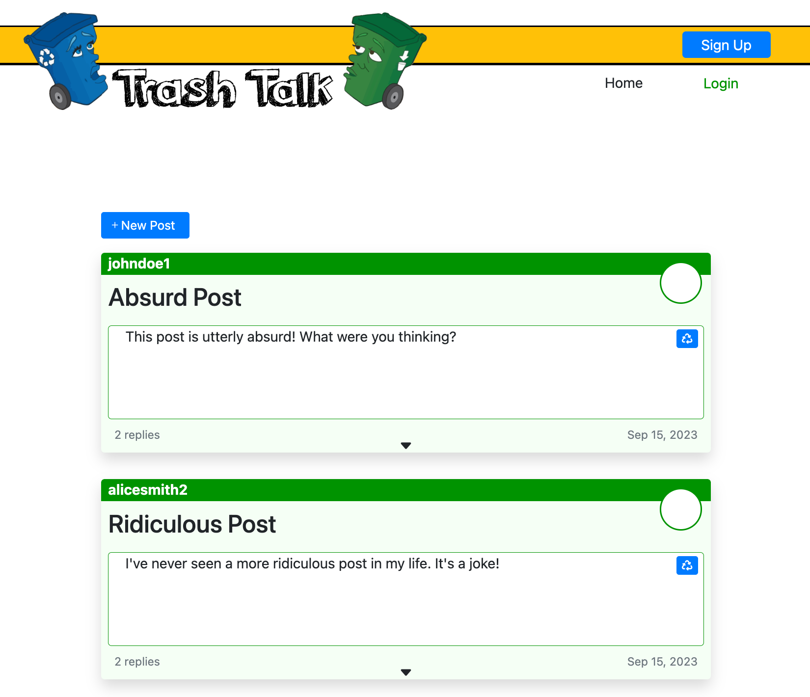 

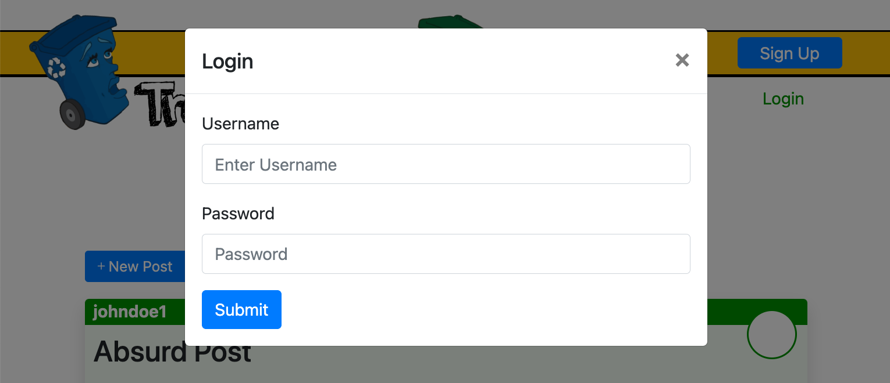 

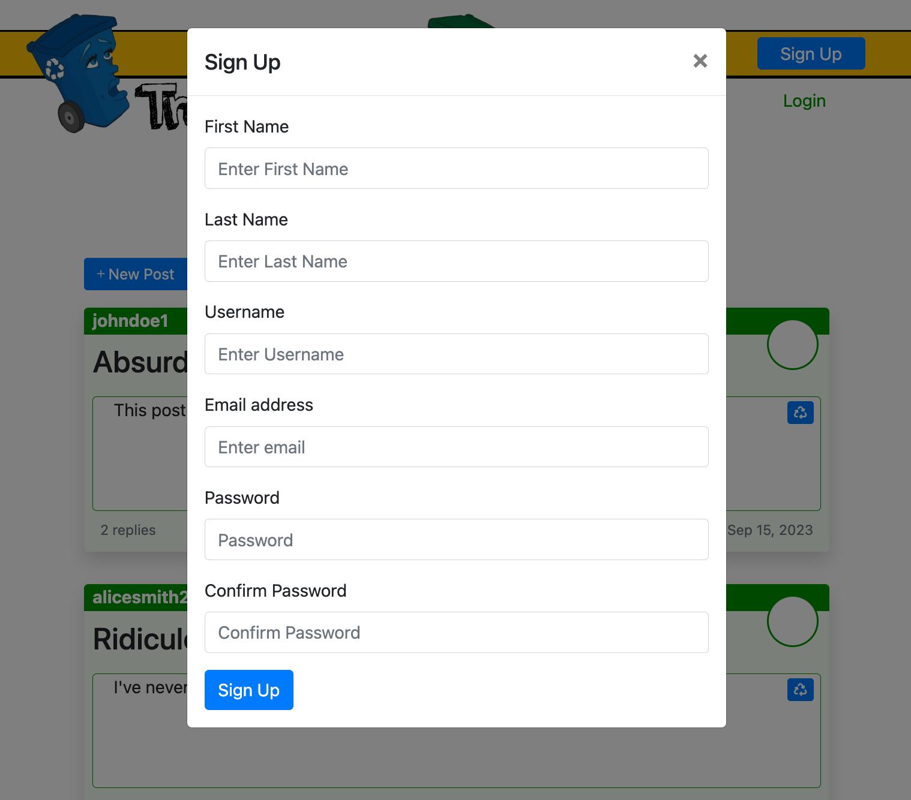 

#### Example 2:
Once logged in, the user can begin interacting with the site. Users can interact with other users' posts on the home page or go to the User Dashboard and see/manage all of their own posts and replies.

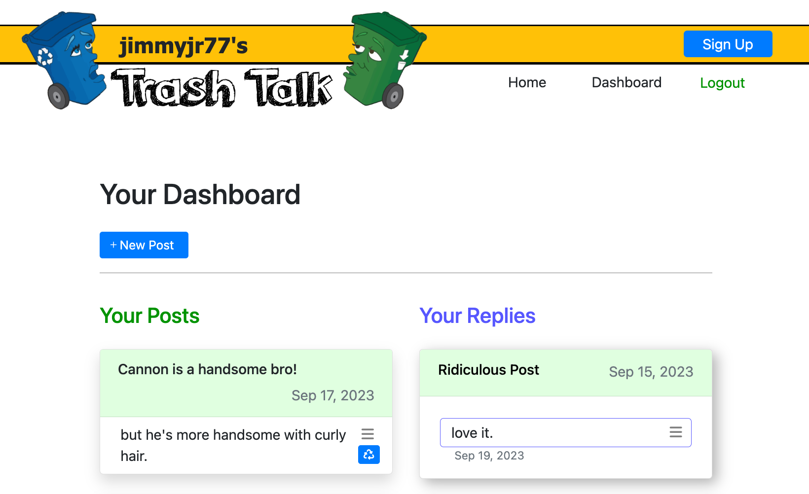 

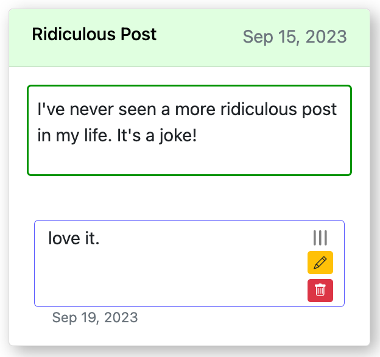

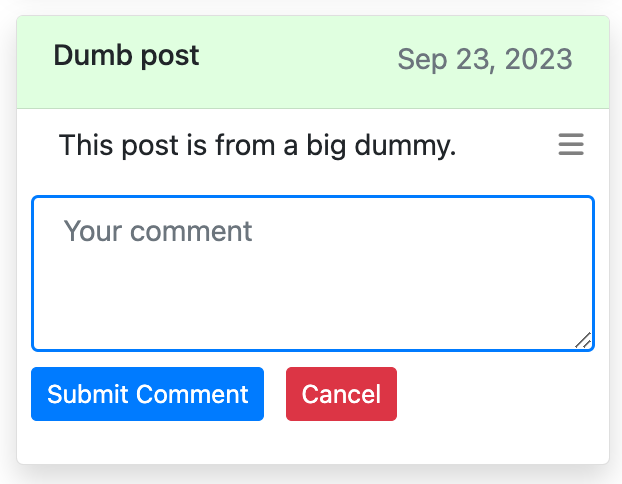 

#### Example 3:
To create a new post, the user can select the new post button on the top of the home and dashboard pages. They must fill out a title and comment to fulfill posting requirements.

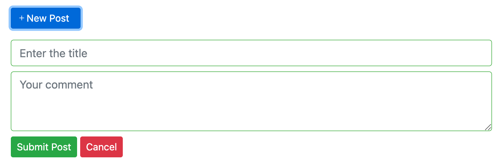 

#### Example 4:
To reply to a post, users can find a recycle symbol in the top right corner of each post. This icon is always visible. It is a recycle symbol instead of a traditional reply symbol because their trash talk will be recycled into a polite reply once full functionality is in play. They can reply to other users' posts as well as their own posts.

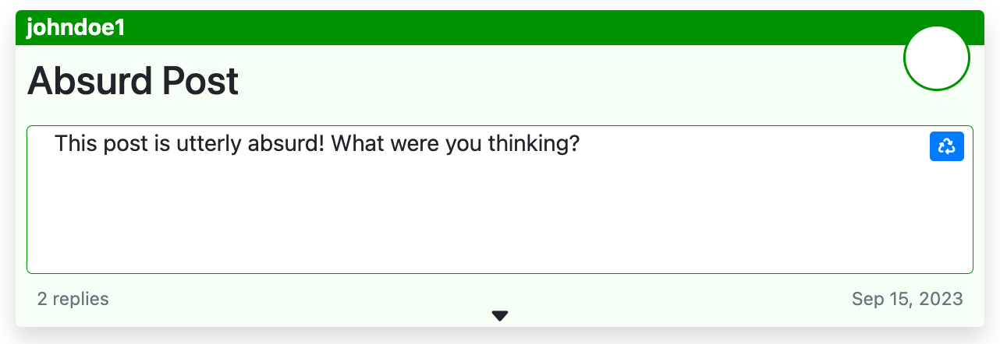 

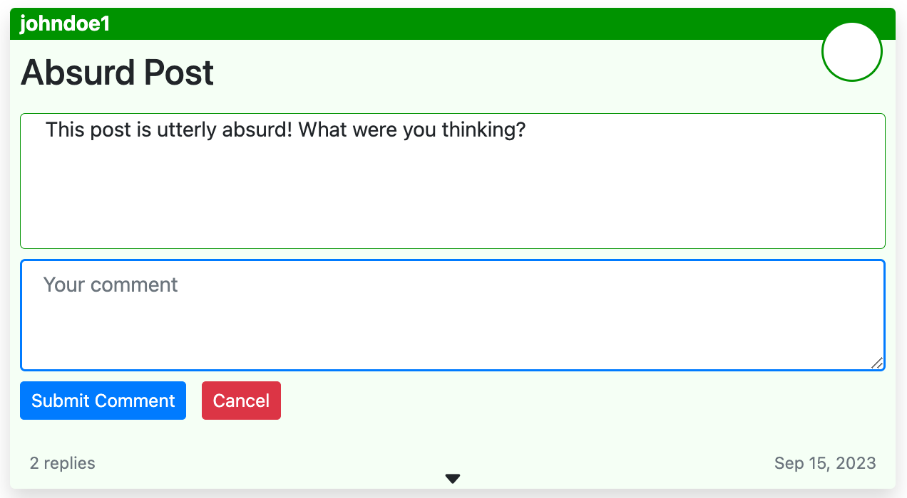 

#### Example 5:
To access edit and delete functionality for posts and replies, users can find a hamburger icon in the top right of any post or reply comment window for which they are the owner. By clicking on this icon, it will spin 90 degrees and open up the edit/delete button menu.

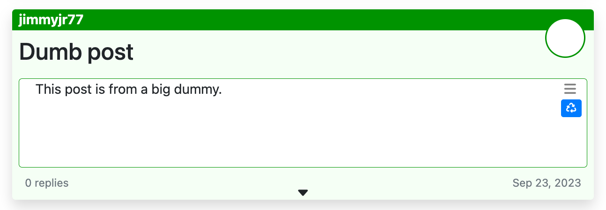

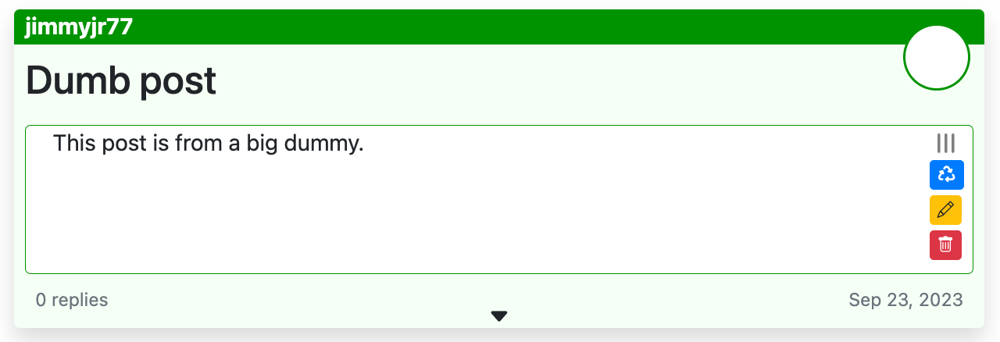 

#### Example 6:
Users can select the edit button and correct their post and reply text in the drop down forms.

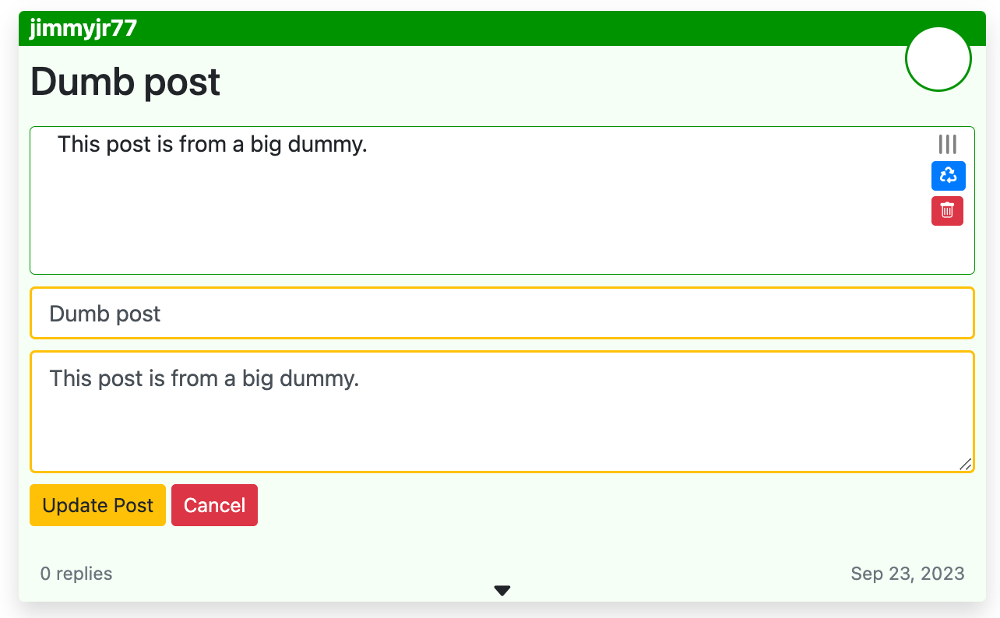 

#### Example 7:
Users can select the delete button to delete the selected post or reply. They will be prompted to verify their intention to do so. 

#### Example 8:
Upon logging in, the login button will be replaced by a logout button. Users can logout by selecting the logout link. If users remain inactive for 15 minutes, they will be logged out automatically.

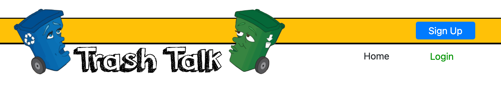 

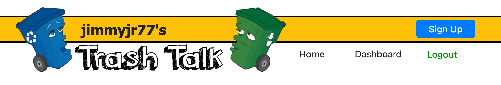 

## Credits
  * I worked with an AskBCS representatives to solve a variety of sticking points and discussed some pain points with course instructors.
  * I was able to reuse some basic html functionality from my work on a previous project.
  * ChatGPT supported with general back and forth dialogue to better understand concepts and problem solve. 
  * Documentation was referenced for a variety of troubleshooting.

#### Tutorials Followed:

  * https://dev.mysql.com/doc
  * https://chat.openai.com
  * https://handlebarsjs.com/
  * https://github.com/ericf/express-handlebars
  * https://www.npmjs.com/package/bcrypt
  * https://sequelize.org/master/
  * https://sequelize.org/master/manual/assocs.html
  * https://expressjs.com/
  * https://expressjs.com/en/guide/using-middleware.html
  * https://expressjs.com/en/guide/routing.html
  * https://www.npmjs.com/package/express-session
  * https://www.npmjs.com/package/connect-session-sequelize
  * https://beta.openai.com/docs/

## License
MIT License

## Badges
  * 

  *  
  
  *  

  *  
  
  * 

## Features
  * Auto logout after 15 minutes of no activity

  * Create an account

  * Users can easily manage all of their posts & replies in their personal dashboard

  * Users can post, reply to posts, and edit and delete all posts and replies for which they are the owner.

  * Users can review their replies to other posts by scrolling over the post titles and dates. Users can view the post content by clicking on the post title.
  
  * Future feature: Once a user sends a message it gets run through generative AI to reconstruct (recycle) their trash talk into a more thoughtful, polite, and constructive manner.

## How to Contribute
Contributions to the Trash Talk application are encouraged and can be made by forking the repository on GitHub, creating a new branch, making changes to enhance functionality, and submitting a pull request. The maintainers will review the changes, provide feedback if needed, and merge approved contributions into the main branch. This collaborative process allows contributors to actively improve the Note Taker application and make it more valuable for users.

## Questions 
If you have any questions about the content, instructions, or how to get involved in this project, please contact: 

  * Jimmy O'Brien    
    GitHub Username: [jimmyjr77](https://github.com/jimmyjr77/)    
    Email Address: jimmyjr.obrien@gmail.com    